# Risky Business

In this project, I constructed and evaluated several machine-learning techniques used to predict credit risk for peer-to-peer lending companies. These types of companies, such as LendingClub or Prosper, allow investors to make loans to other people without the use of banks. This type of lending can be high-risk without the right machine-learning model, so finding the correct algorithm will allow them to mitigate risk and incentivize more investments.

Considering that credit risk is an imbalanced classification problem (the number of good loans is much higher than the number of at-risk loans), I employed different techniques for training and evaluating models with imbalanced classes. In the first technique, I resampled the data using four different algorithms from the imbalanced-learn library. I then used this resampled data to build a logistics regression classifier and evaluated the performance of each of the four models. 

In the second technique, I used the unsampled data to create and evaluate two ensemble classifier, a `Balanced Random Forest classifier`, and an `Easy Ensemble AdaBoost classifier`. 

## Resampling Technique ([credit_risk_resampling.ipynb](https://github.com/EmilianoAmador/Unit_11_Classification_Risky_Business/blob/master/Code/credit_risk_resampling.ipynb))

Used the imbalanced-learn library to resample the quarterly data from LendingClub:

1. Oversampled the data using the `Naive Random Oversampler` and `SMOTE` algorithms.
2. Undersampled the data using the `Cluster Centroids` algorithm.
3. Over- and under-sampled using a combination `SMOTEENN` algorithm.

For each resampled data above:

1. Trained `logistic regression classifier` from `sklearn.linear_model`.
2. Calculated the `balanced accuracy score` from `sklearn.metrics`.
3. Calculated the `confusion matrix` from `sklearn.metrics`.
4. Printed the `imbalanced classification report` from `imblearn.metrics`.

## Results:

**Parameters set for Logistic Regression Model:**
 
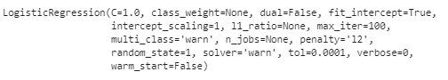

## Naive Random Oversampling

**Confusion Matrix:**
 
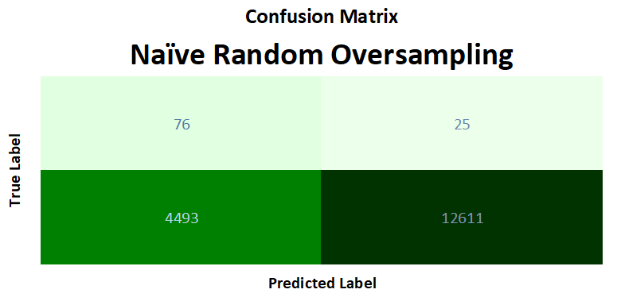
 
 
 
**Imbalanced Calssification Report:**
 
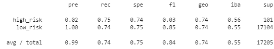
 
 

## Smote Oversampling

**Confusion Matrix:**
 
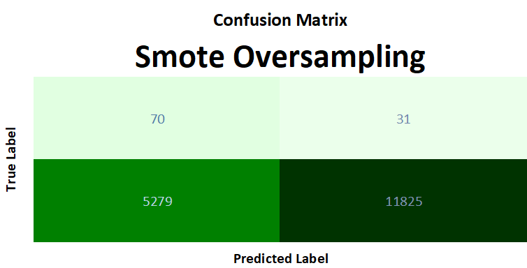
 
 
 
**Imbalanced Calssification Report:**
 
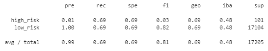
 
 

## Cluster Centroids Undersampling

**Confusion Matrix:**
 
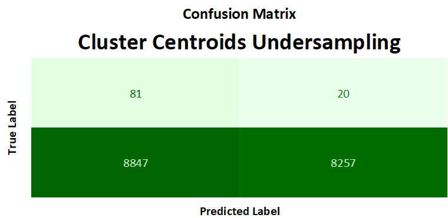
 
 
 
**Imbalanced Calssification Report:**
 
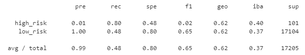
 
 

## Smoteen Combination Sampling

**Confusion Matrix:**
 
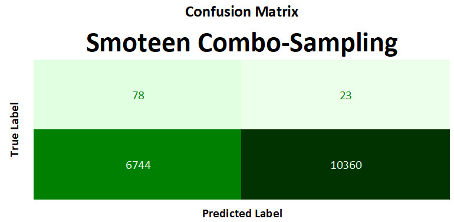
 
 
 
**Imbalanced Calssification Report:**
 
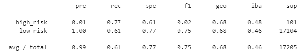
 
 

**Conclusion:**
 
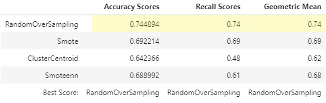
 
The Naive Random Oversampling out-performs the rest of the sampling techniques. As seen on the table above, it has a better overall Accuracy, Recall, and Geometric Mean. This means that it is better at predicting credit risk. 

## Ensemble Learning Technique ([credit_risk_ensemble.ipynb](https://github.com/EmilianoAmador/Unit_11_Classification_Risky_Business/blob/master/Code/credit_risk_ensemble.ipynb))

I trained and compared two different ensemble classifiers to predict loan risk and evaluate each model. I used the `balanced random forest classifier` and the `easy ensemble AdaBoost classifier`, and used 100 estimators for each. 

For each ensemble classifier:

1. Trained the model using the quarterly data from LendingClub.
2. Calculated the balanced accuracy score from `sklearn.metrics`.
3. Printed the confusion matrix from `sklearn.metrics`.
4. Generated a classification report using the `imbalanced_classification_report` from imbalanced learn.

## Results:
## Balanced Random Forest

**Parameters set for the model:**
 
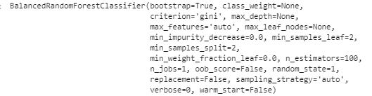
 
 
 
**Confusion Matrix:**
 
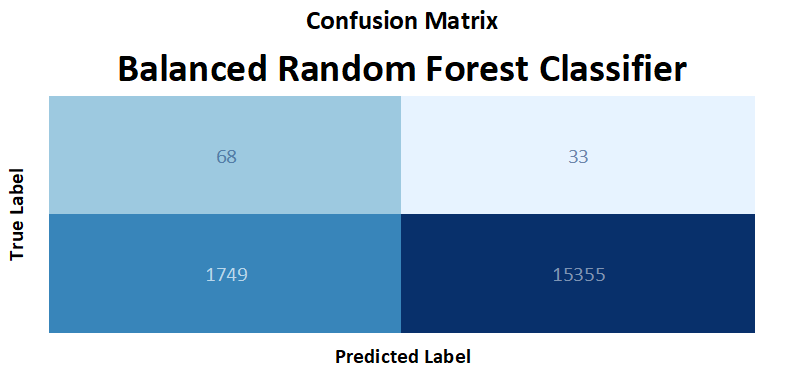
 
 
 
**Imbalanced Calssification Report:**
 
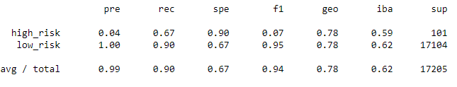
 
 
## Easy Ensemble Ada Boost

**Parameters set for the model:**
 
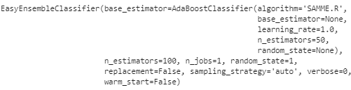
 
 
 
**Confusion Matrix:**
 
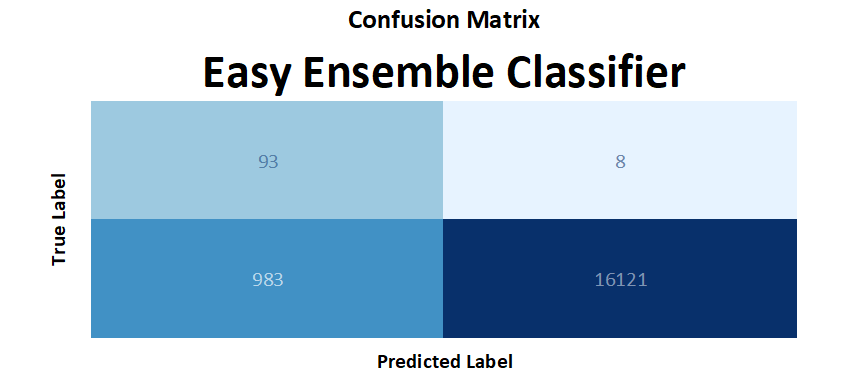
 
 
 
**Imbalanced Calssification Report:**
 
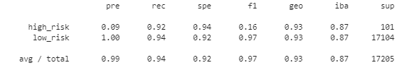
 
 

#### Conclusions:

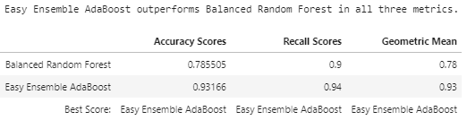
 
 
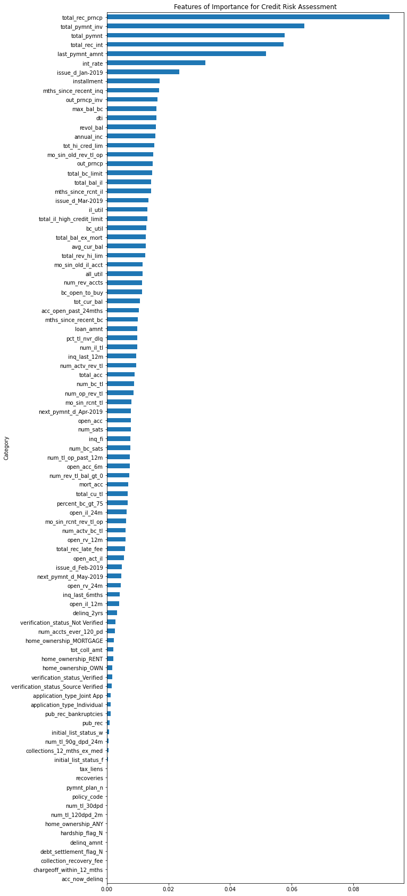
